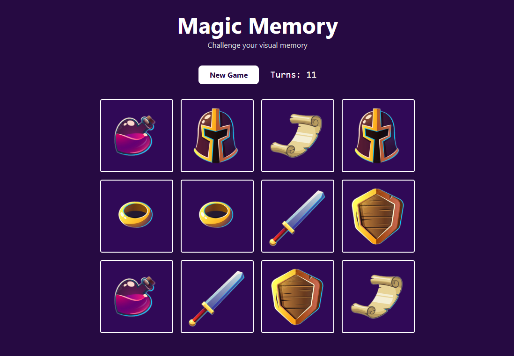

# 🧠 Magic Memory Game

**Demo:** https://magic-memory-gamee.netlify.app/

A simple and fun memory card matching game built with React and Tailwind CSS. The project demonstrates React concepts such as `useState`, `useEffect` and `useCallback` while providing a clean and responsive user experience.

## 🎉 Build With:

- React js
- Tailwind CSS
- Vite
